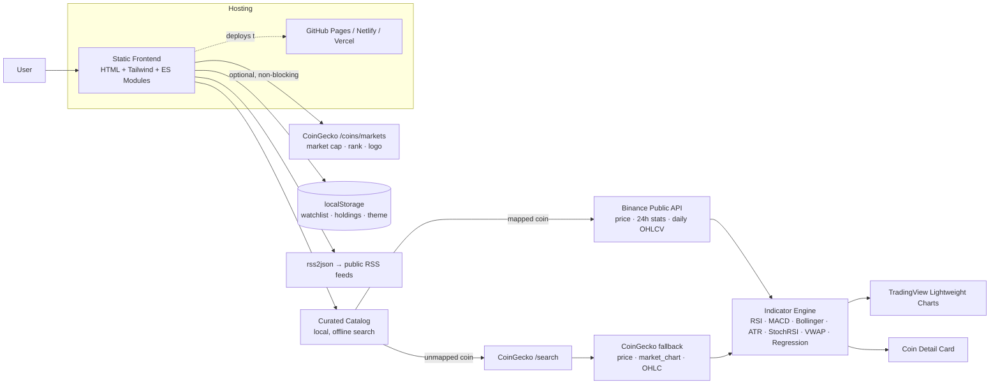

<div align="center">

# 📊 Crypto Analyzer

**Real market data, real technical indicators, zero backend.**

Search any major crypto asset — get live price data, a real candlestick chart, honest technical indicators (RSI, MACD, Bollinger Bands, ATR, Stochastic RSI, VWAP), a statistical trend line, and a side-by-side asset comparison, all computed client-side with no server, no signup, and no AI claims dressing up plain math.

[](https://developer.mozilla.org/en-US/docs/Web/HTML)
[](https://tailwindcss.com)
[](https://developer.mozilla.org/en-US/docs/Web/JavaScript)
[](https://binance-docs.github.io/apidocs/)
[](https://www.coingecko.com/en/api)
[](https://github.com/tradingview/lightweight-charts)
[](#-contributing)
[](./LICENSE)

**[🐛 Report Bug](https://github.com/Naman-27072004/crypto-analyzer/issues)** · **[✨ Request Feature](https://github.com/Naman-27072004/crypto-analyzer/issues)**

</div>

---

## 🤔 Why Crypto Analyzer?

Most portfolio-project crypto dashboards lean on marketing language they can't back up — "AI-powered forecasts," "institutional-grade" analysis — that falls apart under a technical interview question. At the same time, most also route every request through a single free API tier and fall over the moment it rate-limits.

Crypto Analyzer is the opposite bet: every indicator is standard, textbook technical-analysis math, clearly labelled as such — and every claim in this README is something the code actually does. Price and candle data come from Binance's public API (keyless, ~1200 requests/min) instead of a single fragile free tier, with CoinGecko layered in only as optional, non-blocking enrichment for market cap and logos. If that enrichment call fails, the core experience — price, chart, indicators, trend line — doesn't even notice.

---

## ✨ Features

**Instant Search & Autocomplete**
A curated catalog of major assets resolves searches locally with zero network calls while typing, falling back to CoinGecko's search only for coins outside that list — and sidestepping the scam/impersonator tokens that pollute raw exchange-wide coin lists.

**Real Daily Candlestick Chart**
365 days of genuine daily OHLCV data from Binance, rendered with TradingView's open-source Lightweight Charts library — not the sparse multi-day candles a free-tier aggregator API gives you.

**Honestly-Labelled Technical Indicators**
RSI(14), MACD(12/26/9), Bollinger Bands(20, 2σ), ATR(14), Stochastic RSI(14), and VWAP — computed from real OHLCV data, each with a plain-language tooltip explaining what it means and where the read comes from.

**Trend Analysis, Not "AI Prediction"**
An ordinary least-squares linear regression fit to the last 30 daily closes, reported together with its R² so the fit quality is visible instead of implied. It's a statistical trend line, not a machine-learning model, and the UI says so.

**Compare Tool**
Two assets side by side: price, market cap, 24h/7d/30d returns, a normalized 90-day price-overlay chart, a relative-momentum radar chart, annualized volatility, and a Sharpe ratio (0% risk-free rate, clearly caveated).

**Watchlist & Portfolio Tracker**
Add coins to a sortable watchlist (by name, price, or 24h change) or log holdings with a cost basis for live unrealized P/L — stored in `localStorage`, so it's per-browser with no account system, by design.

**Crypto News with Topic Filters**
Headlines streamed from public RSS feeds, filterable by Bitcoin / Ethereum / Regulation / NFT / DeFi, tagged with a keyword-based sentiment heuristic that's labelled as exactly that — not dressed up as NLP.

**Resilience Built In**
Every request is queued and throttled app-wide, cached with a sensible TTL, and retried with exponential backoff on rate limits — so the app degrades gracefully instead of throwing a raw fetch error at the user.

---

## 🧭 How it works

```
Search query
      ↓
 Curated catalog match (instant, offline)
      │
      ├── Found → Binance (price, 24h stats, daily OHLCV klines)
      │                ↓
      │         Technical indicators + regression trend
      │                ↓
      │      Optional CoinGecko enrichment (market cap, logo)
      │           — failure here never blocks the card
      │
      └── Not found → CoinGecko /search → CoinGecko fallback data
                       (same indicators, same trend line)
                              ↓
                  Rendered dashboard (chart · indicators · trend)
```

---

## 🏗️ Architecture



- **App**: a zero-build static site — plain HTML, Tailwind CSS (CDN), and vanilla JavaScript ES modules.
- **Data layer**: Binance's public API is the primary source for price/candle data (free, keyless, high rate limit); CoinGecko is a secondary, optional source used only for market cap/logo enrichment and as a fallback for coins outside the curated catalog.
- **Indicator engine**: pure, dependency-free JavaScript functions computing standard TA formulas and OLS linear regression — no ML libraries, no model weights.
- **Persistence**: watchlist, holdings, and theme preference live in `localStorage` — there's no backend and no database.
- **Charts**: TradingView's open-source Lightweight Charts library for candlesticks and the compare page's price overlay.

---

## 🛠️ Tech Stack

### Frontend
- **HTML5 / Tailwind CSS (CDN)** — no build step, single-file styling via utility classes
- **Vanilla JavaScript (ES Modules)** — no framework, no bundler
- **[TradingView Lightweight Charts](https://github.com/tradingview/lightweight-charts)** — candlestick and line chart rendering
- **Font Awesome 6** — icons

### Data
- **[Binance Public API](https://binance-docs.github.io/apidocs/)** — price, 24h stats, and daily OHLCV klines (free, keyless)
- **[CoinGecko API](https://www.coingecko.com/en/api)** — optional market cap/rank/logo enrichment and search fallback
- **[rss2json](https://rss2json.com/)** — RSS-to-JSON proxy for the news feed

### Analysis
- Custom-built technical indicator engine (RSI, MACD, Bollinger Bands, ATR, Stochastic RSI, VWAP)
- Ordinary least-squares linear regression for trend analysis
- Annualized volatility and simplified Sharpe ratio calculations for the compare page

---

## ⚡ Performance

- All outbound requests are funnelled through a single app-wide queue with a minimum gap between dispatches, so simultaneous lookups (e.g. a coin's price + chart + stats) don't burst and trip rate limits
- Responses are cached in `localStorage` with a per-endpoint TTL (2–10 minutes depending on how often that data actually changes), so repeat lookups and portfolio refreshes don't refire unnecessarily
- 429 responses back off exponentially (1.5s → 3s → 6s → 12s) instead of failing immediately
- Search-as-you-type is debounced and, for catalog-listed coins, resolves with zero network calls at all
- CoinGecko enrichment (market cap, logo) is fetched with a short timeout and is fully optional — a slow or failed call never blocks price, chart, or indicators from rendering

---

## 📁 Project Structure

```
crypto-analyzer/
├── index.html                 # Single-page app shell
├── css/
│   └── style.css               # Theme tokens, tooltips, autocomplete dropdown
├── js/
│   ├── main.js                  # App entry point — wires up all modules
│   ├── cache.js                  # Request queue, retry/backoff, localStorage cache, debounce
│   ├── dom.js                     # Safe DOM-building helpers (no innerHTML) + formatters
│   ├── catalog.js                  # Curated coin list — name/symbol → Binance pair, instant local search
│   ├── coinlist.js                  # Search resolution: catalog first, CoinGecko fallback
│   ├── binance.js                    # Binance public API wrapper (ticker, klines, returns)
│   ├── indicators.js                  # RSI, MACD, Bollinger, ATR, StochRSI, VWAP, regression, volatility, Sharpe
│   ├── search.js                       # Coin search, detail card, chart, indicator panel
│   ├── predict.js                       # Trend Analysis section
│   ├── compare.js                        # Two-coin comparison: table, overlay chart, radar chart
│   ├── portfolio.js                       # Watchlist + holdings (localStorage), sorting
│   ├── news.js                             # RSS news feed with topic filters + sentiment heuristic
│   └── theme.js                             # Dark/light toggle, mobile menu
├── .github/workflows/
│   └── static.yml              # GitHub Pages deployment workflow
├── favicon.png
├── LICENSE
└── README.md
```

---

## 🚀 Getting Started (Local Development)

### Prerequisites

- Any static file server — Python, Node, or PHP all work. **No API keys, no signup, no build tooling required.**

### 1. Clone the repository

```bash
git clone https://github.com/Naman-27072004/crypto-analyzer.git
cd crypto-analyzer
```

### 2. Serve it locally

The app uses ES module imports, which browsers block over `file://` — it needs to be served over `http://`.

```bash
# Python
python -m http.server 8000

# Node (no install required)
npx serve . -l 8000

# PHP
php -S localhost:8000
```

### 3. Open it

Visit `http://localhost:8000` in your browser. That's the whole setup.

---

## 🔑 API & Data Sources

Unlike most projects in this space, Crypto Analyzer needs **no environment variables and no API keys** to run:

| Source | Used for | Auth required |
| :--- | :--- | :--- |
| Binance Public API | Price, 24h stats, daily OHLCV candles | No |
| CoinGecko API | Market cap, rank, logo (optional), search fallback | No (free anonymous tier) |
| rss2json | Crypto news headlines | No (free anonymous tier) |

If you want higher, dedicated CoinGecko rate limits for heavier personal use, a free CoinGecko Demo API key can be added to the enrichment calls in `search.js` and `compare.js` — but the app runs fully without one.

---

## 🌐 Deployment

Crypto Analyzer is a static site with zero build step — push it anywhere that serves static files:

- **GitHub Pages** — a ready-to-use workflow lives at `.github/workflows/static.yml`; enable it under **Settings → Pages → Source → GitHub Actions**
- **Netlify / Vercel** — drag-and-drop the folder or connect the repo; no build command needed
- **Anywhere else** — it's plain HTML/CSS/JS, so any static host works

---

## 🎨 Design Philosophy

Crypto Analyzer is built around a few core principles:

- **Honest over impressive-sounding** — every indicator is labelled for what it actually is; nothing is called "AI" or "institutional-grade" that isn't
- **Resilient by default over fragile-and-fast** — a request queue, caching, and backoff exist because a demo that rate-limits itself in front of a recruiter is worse than a slightly slower one that doesn't
- **Curated over exhaustive** — a hand-picked catalog of real, exchange-listed assets beats naive matching against a scam-polluted 17,000-coin list
- **Optional enrichment, never a blocker** — anything not essential to the core experience (market cap, logos) is allowed to fail silently rather than break the page
- **Zero backend, zero accounts** — everything runs in the browser; watchlist and holdings live in `localStorage` by design, not as a limitation to apologize for

---

## 🗺️ Roadmap

- [ ] Timeframe selector (1D/7D/1M/3M/6M/1Y/ALL) for the candlestick chart
- [ ] Optional CoinGecko Demo API key support for higher enrichment rate limits
- [ ] Exportable PDF/image snapshot of a coin's analysis card
- [ ] Additional indicators (Ichimoku Cloud, OBV, Fibonacci retracement)
- [ ] Shareable/bookmarkable comparison links
- [ ] Portfolio import/export (JSON)

---

## 🤝 Contributing

Contributions are welcome. To contribute:

1. Fork the repository
2. Create a feature branch (`git checkout -b feature/your-feature`)
3. Commit your changes (`git commit -m "Add your feature"`)
4. Push to your branch (`git push origin feature/your-feature`)
5. Open a Pull Request

---

## 📄 License

This project is licensed under the terms specified in the [LICENSE](./LICENSE) file (MIT).

---

## 👤 Author

GitHub: